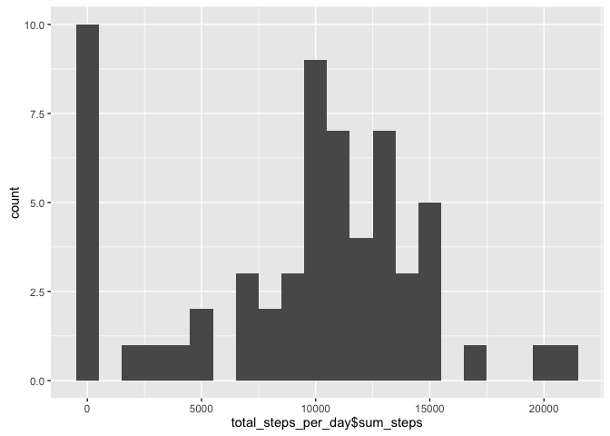
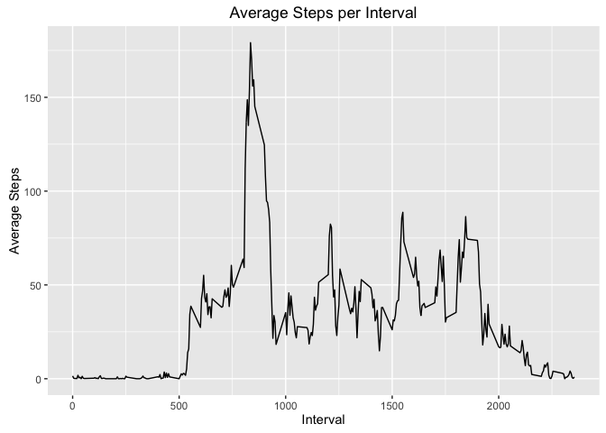
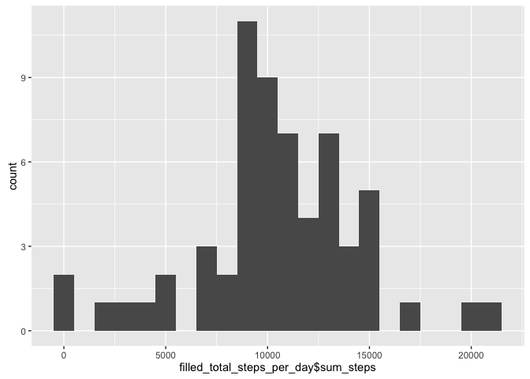
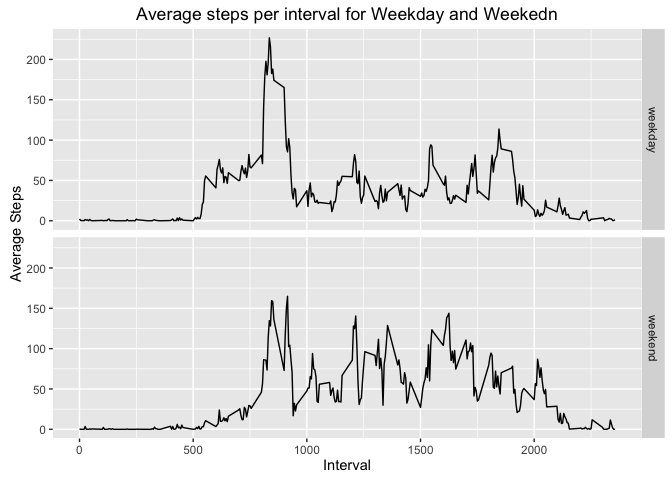

# Reproducible Research: Peer Assessment 1


## Loading and preprocessing the data


```r
unzip("./activity.zip")
raw_data <- read.csv("./activity.csv")
```


```r
# load the essnetial libraries
library(dplyr)
library(ggplot2)
```


## What is mean total number of steps taken per day?

1. Calculate the total number of steps taken per day
First, get the total steps per day by grouping the data of same day.
Then, get the mean value of the total steps.

2. Make a histogram of the total number of steps taken each day
Pick the bindwidth as 1000 since this width seems reasonable.

3. Calculate and report the mean and median of the total number of steps taken per day


```r
# Q 1 
total_steps_per_day <- raw_data %>%
    group_by(date) %>%
    summarise(sum_steps = sum(steps,na.rm=TRUE) )
summary(total_steps_per_day)
```

```
##          date      sum_steps    
##  2012-10-01: 1   Min.   :    0  
##  2012-10-02: 1   1st Qu.: 6778  
##  2012-10-03: 1   Median :10395  
##  2012-10-04: 1   Mean   : 9354  
##  2012-10-05: 1   3rd Qu.:12811  
##  2012-10-06: 1   Max.   :21194  
##  (Other)   :55
```

```r
# Q 2 
qplot(total_steps_per_day$sum_steps, geom="histogram", binwidth = 1000)
```

<!-- -->

```r
# Q 3 
mean_total_steps <- mean(total_steps_per_day$sum_steps)
median_total_steps <- median(total_steps_per_day$sum_steps)
```

Mean of the total number of steps taken per day is 9354.2295082.
Median of the total number of steps taken per day is 10395.

## What is the average daily activity pattern?

1.Make a time series plot (i.e. type = "l") of the 5-minute interval (x-axis) and the average number of steps taken, averaged across all days (y-axis)
To plot this series plot:
Firstly group all the same interval data together, then get the average steps per interval. 
Secondly, plot the required plot with ggplot. 

2.Which 5-minute interval, on average across all the days in the dataset, contains the maximum number of steps?


```r
#Q 1
interval_average_steps <- raw_data %>%
    group_by(interval) %>%
    summarize(average_steps = sum(steps,na.rm=TRUE)/n())
ggplot(data = interval_average_steps, aes( x = interval, y = average_steps) ) + geom_line() + labs(title = "Average Steps per Interval", y = "Average Steps", x = "Interval")
```

<!-- -->

```r
# Q 2
max_interval <- interval_average_steps[which.max(interval_average_steps$average_steps),]
max_interval
```

```
## Source: local data frame [1 x 2]
## 
##   interval average_steps
##      (int)         (dbl)
## 1      835      179.1311
```

The 835 contains the maximum number of steps across all the days in the dataset.

## Imputing missing values

1. Calculate and report the total number of missing values in the dataset (i.e. the total number of rows with NAs)

2. Devise a strategy for filling in all of the missing values in the dataset. The strategy does not need to be sophisticated. For example, you could use the mean/median for that day, or the mean for that 5-minute interval, etc.

3. Create a new dataset that is equal to the original dataset but with the missing data filled in.

Answer to Question 2&3:
    The na values are filled with the mean for that 5-minute interval. 

4. Make a histogram of the total number of steps taken each day and Calculate and report the mean and median total number of steps taken per day. Do these values differ from the estimates from the first part of the assignment? What is the impact of imputing missing data on the estimates of the total daily number of steps?


```r
# Q 1
numb_na <- length(raw_data$interval) - sum(complete.cases(raw_data))
numb_na
```

```
## [1] 2304
```

```r
# Q 2 Fill na with the mean for that 5-minute interval
# Q 3 Produce filled_data as a copy of original data with na filled.
filled_data <- raw_data
for(i in 1: nrow(filled_data)){
    if(is.na(filled_data[i,1]))
        filled_data[i,1] <- interval_average_steps[interval_average_steps$interval==filled_data[i,3],][[2]]
}

# Q 4 histogram and 
filled_total_steps_per_day <- filled_data %>%
    group_by(date) %>%
    summarise(sum_steps = sum(steps,na.rm = TRUE) )
qplot(filled_total_steps_per_day$sum_steps, geom="histogram", binwidth = 1000)
```

<!-- -->

```r
filled_mean_total_steps <- mean(filled_total_steps_per_day$sum_steps)
filled_median_total_steps <- median(filled_total_steps_per_day$sum_steps)
filled_mean_total_steps
```

```
## [1] 10581.01
```

```r
filled_median_total_steps
```

```
## [1] 10395
```

The mean and median total number of steps taken per day after imputing is 1.0581014\times 10^{4} and 1.0395\times 10^{4}. 
Compared with the mean and median value calculated before imputing is 9354.2295082 and 10395.
According to the mean and median values, the imputing does not impact on the median values of the total daily number of steps but increased the mean value.


## Are there differences in activity patterns between weekdays and weekends?
1. Create a new factor variable in the dataset with two levels – “weekday” and “weekend” indicating whether a given date is a weekday or weekend day.

2. Make a panel plot containing a time series plot (i.e. 𝚝𝚢𝚙𝚎 = "𝚕") of the 5-minute interval (x-axis) and the average number of steps taken, averaged across all weekday days or weekend days (y-axis).

Firstly create a dataframe that contains the average steps per interval based on Weekday or Weekend.


```r
#Q 1
weekend_index <- grepl("S(at|un)", weekdays(as.Date(filled_data$date)) )
filled_data$weekIndex <- ifelse(weekend_index, "weekend", "weekday")
filled_data$weekIndex <- factor(filled_data$weekIndex)

# Q 2 calculate the average steps values group by weekIndex and interval.
grp_cols <- c("weekIndex", "interval")
dots <- lapply(grp_cols, as.symbol)
filled_interval_average_steps <- filled_data %>%
    group_by_(.dots = dots) %>%
    summarize(average_steps = sum(steps,na.rm=TRUE)/n())

p1 <- ggplot(data = filled_interval_average_steps, aes(x=interval, y = average_steps) )
p1 + geom_line() + facet_grid(weekIndex ~ .) + labs(title = "Average steps per interval for Weekday and Weekedn", x = "Interval", y = "Average Steps")
```

<!-- -->
